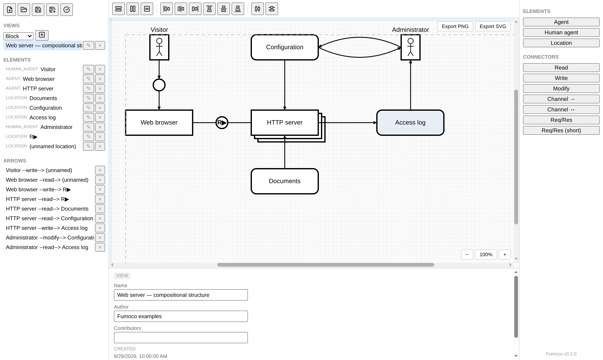
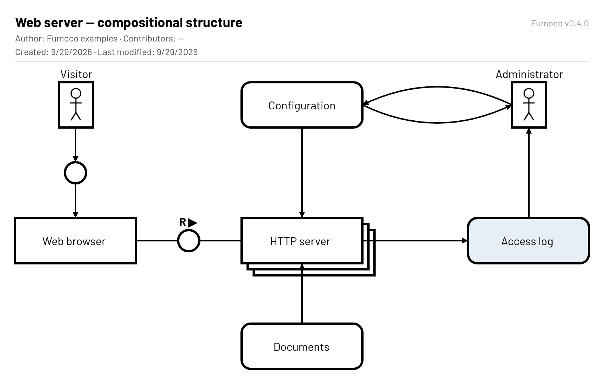
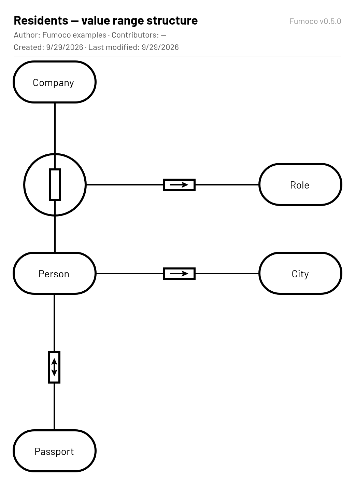

# Fumoco

A browser-based editor for [FMC](https://www.fmc-modeling.org/)
(Fundamental Modeling Concepts) diagrams: **block diagrams** (compositional
structure), **Petri nets** (dynamic structure) and **entity-relationship
diagrams** (value range structure).

Layout is manual, in the spirit of [Archi](https://www.archimatetool.com/)
for ArchiMate: you place every box yourself, with grid snapping, guide
lines, alignment tools and orthogonally routed connectors doing the tedious
parts. There is no auto-layout solver.



## Features

**Modeling**

- One model, many views. Elements and connectors live in the model; each
  view shows a chosen subset of them with its own layout.
- Block diagrams: agents, human agents and locations (storages and
  channels), with read / write / modify access edges, directed and
  bidirectional channels, and request/response channels (long form or
  `R▶` shorthand).
- Many-to-many nesting. An element can be contained in several
  containers, and each view decides where it is _displayed_ nested.
- Petri nets: places (with markings and a start place), transitions
  (including NOP bars) and arcs, with the bipartite rule enforced.
- ER diagrams: entity sets and n-ary relations. A relation's "1" sides
  are shown by an arrow inside the relation (`→`, `←`, `↔`). Relations
  turn 90° automatically between stacked entity sets. Also: reification,
  and orthogonal partitioning drawn as a triangle.
- "Validate model" checks well-formedness rules that shouldn't block you
  while you're still editing, such as a channel's minimum number of
  accessing agents.

**Layout and drawing**

- Grid snapping, guide lines dragged in from the canvas edges (moving
  and resizing snap to both), align / distribute / same-size tools, and
  multi-select by marquee or shift/cmd-click -- a selection moves
  together, into and out of other boxes.
- Undo / redo.
- Orthogonal connectors with rounded corners and draggable waypoints.
- Edge trees: edges entering the same box side can share one trunk
  (opt-in per side).
- Modify edges between facing boxes can be drawn as a lens of two curved
  arrows.
- "Multiple instances" boxes drawn as a stack, an ellipsis (… ⋮ ⋱ ⋰)
  for "A1 … An" enumerations, swimlane dividers, free text, plain lines,
  and a small palette of muted fill colors.
- Connector annotations, and display names that override what a view
  shows for an element or a view's title.
- Zoom (25%–400%), always-visible scrollbars, and a landscape-slide page
  frame that warns when a diagram outgrows one slide.

**Files and export**

- Models are saved as plain JSON (`*.fumoco.json`) and autosaved in the
  browser.
- PNG and SVG export of a view on a white page, with a header: title,
  author, contributors, dates, and the Fumoco version.

| Block diagram export                                 | ER diagram export                              |
| ---------------------------------------------------- | ---------------------------------------------- |
|  |  |

Both are in [`docs/examples/`](docs/examples); open them with the folder
button in the editor.

## Getting started

Requirements: [Node.js](https://nodejs.org/) 20.19 or newer, and npm.

```sh
git clone https://github.com/fundamental-modeling/fumoco.git
cd fumoco
npm ci
npm start
```

Then open <http://localhost:4200>. To reach the dev server from other
machines on your network, run `npx vite --host` instead of `npm start`,
and add the host name you'll use to `server.allowedHosts` in
`vite.config.mjs`.

### Keyboard and mouse

| Action                             | Mac                                                                | Windows / Linux                                             |
| ---------------------------------- | ------------------------------------------------------------------ | ----------------------------------------------------------- |
| Undo / redo                        | <kbd>⌘</kbd> <kbd>Z</kbd> / <kbd>⇧</kbd> <kbd>⌘</kbd> <kbd>Z</kbd> | <kbd>Ctrl</kbd> <kbd>Z</kbd> / <kbd>Ctrl</kbd> <kbd>Y</kbd> |
| Select all                         | <kbd>⌘</kbd> <kbd>A</kbd>                                          | <kbd>Ctrl</kbd> <kbd>A</kbd>                                |
| Cut / copy / paste the selection   | <kbd>⌘</kbd> <kbd>X</kbd> / <kbd>C</kbd> / <kbd>V</kbd>            | <kbd>Ctrl</kbd> <kbd>X</kbd> / <kbd>C</kbd> / <kbd>V</kbd>  |
| Add to / remove from the selection | <kbd>⇧</kbd> or <kbd>⌘</kbd> + click                               | <kbd>Shift</kbd> or <kbd>Ctrl</kbd> + click                 |
| Rename the selected element        | <kbd>Enter</kbd>, or double-click                                  | <kbd>Enter</kbd>, or double-click                           |
| Remove from this view only         | <kbd>Delete</kbd>                                                  | <kbd>Delete</kbd>                                           |
| Delete from the model              | <kbd>Backspace</kbd>                                               | <kbd>Backspace</kbd>                                        |
| Add a waypoint to an edge          | double-click the edge                                              | double-click the edge                                       |
| Pan                                | scroll / trackpad (<kbd>⇧</kbd> for horizontal)                    | scroll wheel (<kbd>Shift</kbd> for horizontal)              |

Right-click boxes, edges, waypoints and the empty canvas for context menus.

## Development

```sh
npm test          # builds, then runs the QUnit suite in headless Chrome
npm test -- --launch Chromium   # on machines with Chromium instead of Chrome
npm run lint
npm run build     # production build into dist/
```

Commits are checked with [pre-commit](https://pre-commit.com/): whitespace,
JSON/YAML checks, the MIT license header on every source file, and
prettier, eslint, ember-template-lint and stylelint (auto-fixing where
they can, using the project's own configs, so run `npm ci`
first):

```sh
pre-commit install          # once per clone
pre-commit run --all-files  # check everything by hand
```

The app is an [Ember](https://emberjs.com/) application built with
[Vite](https://vite.dev/) and [Embroider](https://github.com/embroider-build/embroider),
drawing on a [Konva](https://konvajs.org/) canvas.

### Repository layout

| Path                                  | What it is                                                                                                                                           |
| ------------------------------------- | ---------------------------------------------------------------------------------------------------------------------------------------------------- |
| `app/`                                | The editor (an Ember app): `app/components/canvas-view.gjs` renders and edits the canvas; `app/utils/fmc-model.js` is the model and its JSON format. |
| `tests/`                              | The QUnit suite.                                                                                                                                     |
| `docs/spec/`                          | A formal, [ReSpec](https://respec.org/)-based specification of FMC's notation, written alongside the editor (work in progress).                      |
| `docs/examples/`, `docs/screenshots/` | Example models and the screenshots above.                                                                                                            |
| `docs/LASTENHEFT.md`                  | Requirements, as user stories.                                                                                                                       |
| `docs/PFLICHTENHEFT.md`               | How each requirement is built.                                                                                                                       |
| `docs/implementation_plan.org`        | Checklist of what's done and what's open, by milestone (Org mode).                                                                                   |

### Versioning

Versions follow [semantic versioning](https://semver.org/), derived from
[Conventional Commits](https://www.conventionalcommits.org/) in the style
of semantic-release: `feat:` bumps the minor version, `fix:` the patch
version. Each release is a `chore(release): X.Y.Z` commit tagged `vX.Y.Z`.

## Status and roadmap

- **Milestone A — block-diagram editor:** complete.
- **Milestones B and C — Petri nets and ER diagrams:** usable, with less
  polish than block diagrams (for example, their arcs can't be selected
  by clicking yet).
- **Milestone A.5 — formal specification (`docs/spec/`):** in progress.
- **Milestone D — VS Code extension** (open a model file directly in VS
  Code): planned.

## License

[MIT](LICENSE).
